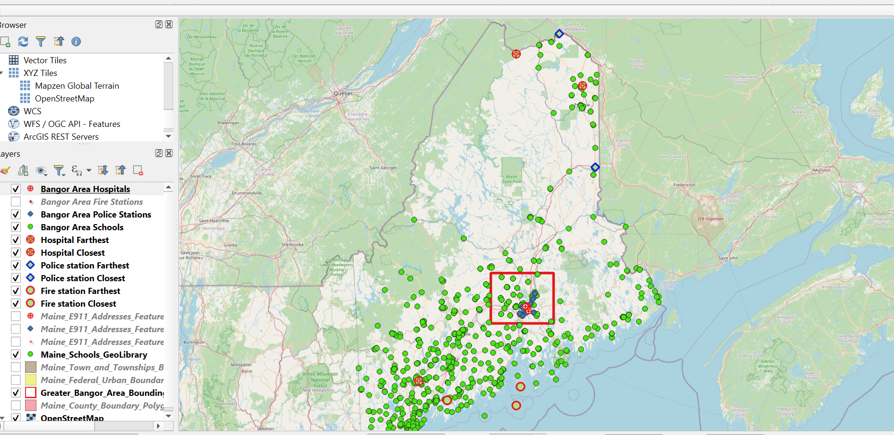

# Maine Amenities Spatial Analysis (PostGIS + QGIS)

## Project Goal

Spatial distribution analysis of Maine **schools** relative to critical public amenities (**fire stations, police stations, hospitals**) using **PostgreSQL/PostGIS** and **QGIS**.

## Questions explored
- Total counts of each amenity type
- Counts per county (spatial join using county boundaries)
- Average number of schools per county
- Counties with max/min counts per amenity type
- Ratios of schools to each amenity type
- Example spatial filters (Bangor area bounding box)
- Proximity checks (closest/furthest examples)

## Map Preview
The preview shows the schools in Maine, and some of the closest and farthest amenities. For instance, On the North East corner of Maine are two blue diamonds and two red circle with a cross. The Northern-most circle overlays on another blue diamond. This was a school that was both farthest to a hospital and police station in Maine (We can see its closest police station to its North, and the closest hospital further South. Interesting enough, the school with the closest police station is not much further south, represented by the second blue diamond (they are actually two diamonds - school and station - but they are so close that we have to zoom in farther to see). 
Green dots represent all schools in Maine.
Red bounding box is the Greater Bangor Area that had more analysis.

## Data Sources

Spatial datasets used in this project were obtained from publicly available Maine GIS repositories.

Primary sources:

- Maine GeoLibrary Data Catalog  
  https://www.maine.gov/geolib/catalog.html

Datasets downloaded from the GeoLibrary:

- Maine Town and Townships Boundary Polygons Feature
- Maine E911 Addresses Feature – Fire Stations
- Maine E911 Addresses Feature – Hospitals
- Maine E911 Addresses Feature – Law Enforcement

Additional dataset:

- Maine Schools GeoLibrary  (Now moved/deleted)
  https://arc-gis-hub-home-arcgishub.hub.arcgis.com/datasets/maine::maine-schools-geolibrary/about

## Data Preparation Workflow

1. Loaded OpenStreetMap basemap in QGIS for geographic reference.
2. Downloaded shapefiles from the Maine GeoLibrary and ArcGIS Hub.
3. Verified coordinate reference systems and dataset integrity.
4. Imported shapefiles into a PostgreSQL database using the QGIS DB Manager.
5. Enabled the PostGIS extension to support spatial queries.
6. Performed spatial analysis using PostGIS SQL queries.

## Files
- `postgres_postgis.sql` – Primary PostGIS queries (counts, spatial joins, ratios, Bangor subset, proximity)
- `qgis_queries.sql` – Queries used inside QGIS (feature inspection, bounding box filters, closest/furthest selections)

## Tools
- PostgreSQL + PostGIS
- QGIS

## Notes / Assumptions
- Distance calculations depend on CRS. For meters, use a projected CRS (e.g., EPSG:26919) or `geography` casting.
- Ratio queries should cast counts to numeric and use `NULLIF` to avoid divide-by-zero.
- Closest-distance queries can be optimized using KNN (`<->`) + `LATERAL` joins.
